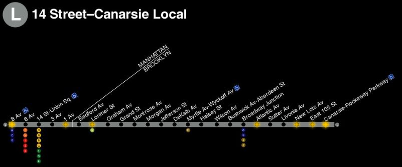

# MTA Light Board

Getting to know the MTA's GTFS realtime schedule info



## Setup

```
npm install
/create a .env file/
node server.js
```

hit localhost:3000 in a browser

## Configuration
Set the following in a .env file or as environment variables:

  * `MTA_KEY` your MTA API KEY (get your own api key at https://api.mta.info/#/landing )
  * `PORT` Listen port (default 3000)
  * `UPDATE_INTERVAL` how frequently you want to hit the mta servers in seconds

.env file example:

    MTA_KEY=xXx_mY-sWEET-mta-kEY_xXx
    PORT=3000
    UPDATE_INTERVAL=5
